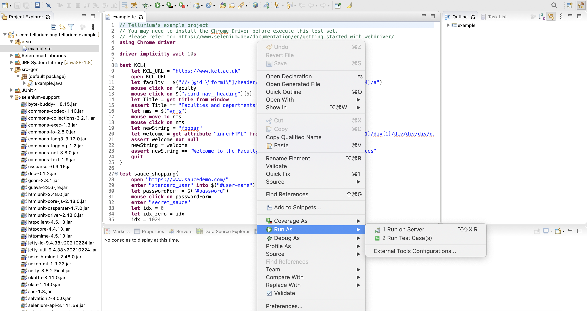
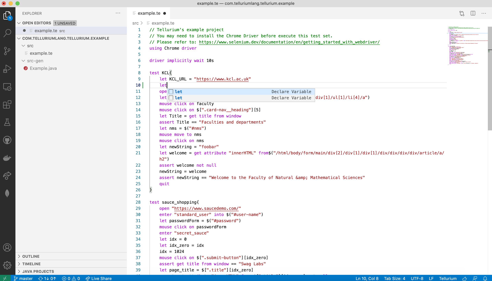

# Tellurium

[](https://github.com/telluriumLang/tellurium/actions/workflows/maven.yml)


Tellurium is a DSL for automation web UI testing.

[Documents](https://telluriumlang.github.io/tellurium/#/) | [Released packages](https://github.com/telluriumLang/tellurium/releases)

## Quick start 🚀

Currently provides two types of plugins for Tellurium:

### Eclipse Plugin



Tellurium has an update site for Eclipse.

You can open your Eclipse and find out the `help` menu then select `Install new software...`. Once the dialog window poped up, input our updatesite's url:

[https://telluriumlang.github.io/updatesite/](https://telluriumlang.github.io/updatesite/)

Select the Tellurium Plguin and install it. All dependencies will be automatically fetch from the repositories.

### Visual Studio Code Extension

You can find out a preview version VS Code Extension from our release page. You can manually install the VSIX file into your VS Code environment.



> **Notice**
> 
> The VS Code extension is an PoC (proof of concept) of the language server protocol and may not supports some of the features in Eclipse plugin. We highly recommend you to try out the Eclipse plugin.
> 

### Runtime Information

You need to install Java 1.8 before using Tellurium. 

If you need to use the browser driver to launch test, please refer to the document in Selenium: [Link](https://www.selenium.dev/documentation/en/getting_started_with_webdriver/)

### Example project

You can find out an Eclipse style example project in:

[com.telluriumlang.tellurium.example](https://github.com/telluriumLang/tellurium/tree/master/com.telluriumlang.tellurium.example)

## How to develop on your local machine

First of all, you need an Ecplise IDE. Then use the `git clone` to clone the repository into your local machine (you can use the EGit in Eclipse as well).

```shell
$ git clone git@github.com:telluriumLang/tellurium.git
```

Import all Tellurium moudles into Eclipse as Maven project. Open com.telluriumlang.tellurium/src/com/telluriumlang/Tellurium.xtext , then right click and select `Run As` -> `Generate XText Artifacts`. Wait for a minutes and enjoy your development!

Alternatively, you can try to use below commands before you import your project into Eclipse if you don't like to use Eclipse's GUI. :)

```shell
$ cd tellurium
$ mvn clean compile
```

**Hints**

- Please don't always add *.projects files to your commit. Try to exclude them manually.
- Sometimes you may find a small red exclamation mark in one of the projects, please go to the problems and check what happens. (Most of the time, this will be caused by missing src folder or src-gen / xtend-gen folders).

## Development Environment

- Java 1.8 and above
- Eclipse ( 2019-12 and above version ) with:
    - Xtext plugin (2.15 and above)
    - Xsematics plugin (1.15 and above)
- VS Code 1.55 (For VS Code plugin only)
- Maven


## Author
- [Shaobin Ou](https://github.com/ousheobin)
- [Yuyang Huang](https://github.com/TigerHuang98)
